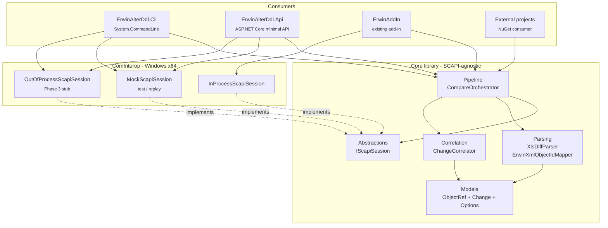
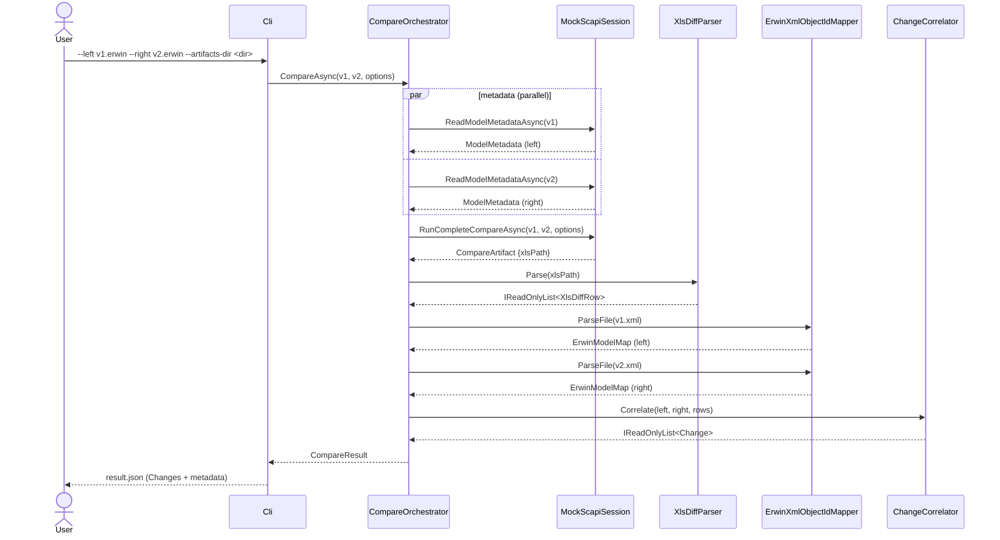
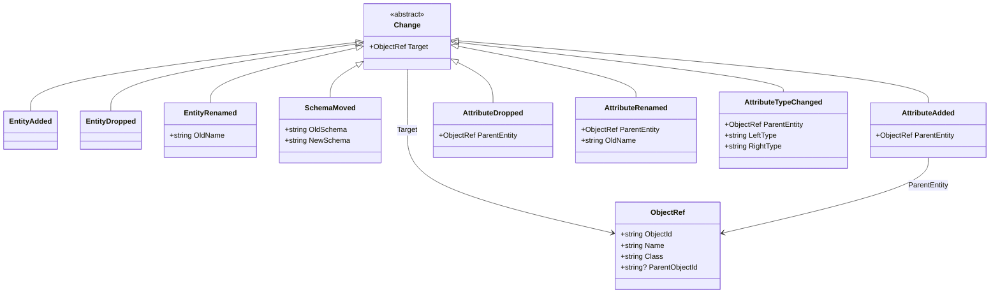

# ErwinAlterDdl Architecture

Phase 2 snapshot. Updated 2026-04-23.

## 1. Goals

Compare two `.erwin` models and produce a typed `Change` list (Phase 2) that a
dialect-aware SQL emitter can turn into alter DDL (Phase 3). Run:
- inside the existing erwin add-in (in-process SCAPI),
- as a standalone CLI (out-of-process SCAPI, Phase 3),
- as a REST daemon that many clients can call over an internal network.

## 2. Component overview

Targets:
- `ErwinAlterDdl.Core` = `net10.0` (framework-agnostic, portable).
- `ErwinAlterDdl.ComInterop` = `net10.0-windows` x64 (needs WinRT / COM).
- `ErwinAlterDdl.Cli`, `ErwinAlterDdl.Api` = `net10.0-windows` x64.
- Tests: `net10.0` for Core, `net10.0-windows` for Integration (Phase 4).

NuGet publish hedefi: `EliteSoft.Erwin.AlterDdl.Core` (and optionally
`EliteSoft.Erwin.AlterDdl.ComInterop`). Consumers take a dependency on Core and
pick or write their own `IScapiSession` implementation.

## 3. Compare request sequence (CLI, Phase 2 mock mode)

In Phase 3, `Mock` becomes `OutOfProcessScapiSession`, which spawns a dedicated
`erwin.exe` child process so the CC + FEModel_DDL calls are isolated from any
user GUI, defeating the SCAPI r10.10 singleton state-pollution bug documented in
`reference_scapi_gotchas_r10.md`.

## 4. Change type hierarchy (Phase 2 subset)

Phase 3 adds: `PrimaryKeyChanged`, `ForeignKey*`, `Index*`, `View*`, `Trigger*`,
`Sequence*`, `AttributeNullabilityChanged`, `AttributeDefaultChanged`,
`AttributeIdentityAdded`.

JSON serialization uses `[JsonPolymorphic]` with a `kind` discriminator so
clients (and the SQL emitter) can pattern-match on it safely. The sealed
hierarchy makes the downstream `switch` exhaustive at compile time.

## 5. Extensibility hooks

- **New change type:** add a sealed record, add `[JsonDerivedType]` line, update
  `ChangeCorrelator` to emit it, add unit test fixture. Compiler forces every
  emitter to handle it.
- **New SCAPI session:** implement `IScapiSession` (3 async methods). Drop into
  DI. No Core changes.
- **New DBMS dialect (Phase 3):** add a `ISqlEmitter` implementation (not yet
  defined in Core). The orchestrator hands it the change list + the target
  metadata to pick one.

## 6. Phase boundaries

| Phase | Scope |
|---|---|
| 0 | Feasibility research (completed) - docs/research_findings.md |
| 1 | Spike PoC (completed, commit 2acf904) |
| **2 (this)** | Shared library + CLI + REST, Change-list output, no SQL emission |
| 3 | `OutOfProcessScapiSession` implementation; SQL emitters per dialect; additional change types; add-in UI button |
| 4 | End-to-end integration tests across MSSQL / Db2 / Oracle fixtures, golden-master alter SQL |
