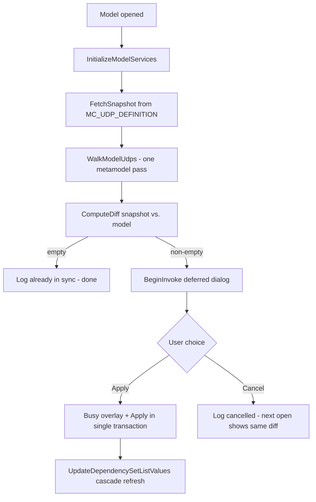

# Architecture: Admin → Model UDP Sync

Last updated: 2026-05-16

This document covers the UDP definition sync feature added in May 2026
(plan: `C:\Users\Kursat\.claude\plans\tingly-doodling-russell.md`). It is
intentionally narrow: only the parts that span the addin and the admin DB
contract. Pure addin internals are documented inline in the source files.

---

## What it does

When a model is opened, the addin compares the UDP definitions stored in
the admin DB (the `CONFIG` row bound to this model) against the
`Property_Type` objects currently in the erwin metamodel. If anything
differs, a custom dialog lists every Create / Update entry and asks the
user to Apply or Cancel.

Deletes are never proposed: a model `Property_Type` missing from the
admin snapshot is indistinguishable from a user-authored UDP and we will
not silently destroy user data. Users remove unwanted UDPs themselves
through erwin's own UDP editor.

---

## Code surface

| Layer | File | Responsibility |
|-------|------|----------------|
| Snapshot fetch | [Services/UdpSyncEngine.cs](../Services/UdpSyncEngine.cs) `FetchSnapshot` | Read `MC_UDP_DEFINITION` + `MC_UDP_LIST_OPTION` for the active CONFIG. Normalise admin `Boolean` UDPs to `List(True, False)` at this boundary. |
| Metamodel walk | `UdpSyncEngine.WalkModelUdps` | Single level-1 session pass that returns both the canonical-keyed `ModelUdpSnapshot` map and the full Property_Type name set. The names set feeds `ModelConfigForm._cachedPropertyTypeNames` so `ValidationCoordinator` does not walk again. The map is keyed on the canonical identity from `BuildCanonicalKey` so a UDP is matched whether its `Property_Type.Name` is the full path `Entity.Physical.X` or the bare leaf `X`. |
| Diff (pure) | `UdpSyncEngine.ComputeDiff` | Pairs snapshot rows against the model map by canonical `<Owner>.Physical.<Name>`. Emits only Create + Update. |
| Canonical key | `UdpSyncEngine.BuildCanonicalKey` | erwin's own UDP editor STORES the full path `Owner.Scope.Leaf` and only DISPLAYS the leaf; erwin's MIMB importer and MetaSync's `RenameCreatedUdpsToLeaf` store the bare leaf. The value accessor is owner+scope+leaf and name-label-independent, so both forms are the same UDP. This helper normalises either form to `{Owner}.{Scope}.{Leaf}`, deriving the owner from `tag_Udp_Owner_Type` (GUID-suffix form e.g. `+40200003`=Entity, or the plain class string) for bare leaves, so an imported (leaf-named) model UDP is not misread as a missing Create. |
| Apply | `UdpSyncEngine.Apply` | Single named transaction, Updates then Creates. Type / default / list-values / definition all written in place. EBS-1057 unique-name conflicts are tolerated. |
| Dialog | [Forms/UdpSyncDialog.cs](../Forms/UdpSyncDialog.cs) | Borderless modal with action chips, summary counters, drag-by-header, multi-monitor positioning. |
| Wire-up | [ModelConfigForm.RunUdpSyncIfNeeded](../ModelConfigForm.cs) | Runs between dep-set load and `UdpRuntime.Initialize`. Deferred `ShowDialog` via `BeginInvoke` so it does not deadlock `Form.Load`. |
| Runtime cascade | [Services/UdpRuntimeService.cs](../Services/UdpRuntimeService.cs) `UpdateDependencySetListValues` | Recomputes `tag_Udp_Values_List` for dependency-set-driven UDPs whenever the model UDP values change. Short-circuits when `MappingCount == 0`. |

---

## Admin DB contract

The admin module owns the schema. The addin **reads** from it on every
model open and **writes** the `Apply` result into the erwin metamodel
(never back into the admin DB).

### Read by the addin

| Table | Columns read | Purpose |
|-------|--------------|---------|
| `MC_UDP_DEFINITION` | `ID`, `NAME`, `DESCRIPTION`, `OBJECT_TYPE`, `UDP_TYPE`, `DEFAULT_VALUE`, `CONFIG_ID`, `IS_REQUIRED`, `IS_LOCKED`, `MIN_VALUE`/`MAX_VALUE`/`MAX_LENGTH`, `VALIDATION_OPERATOR`/`VALIDATION_VALUE`, `ERROR_MESSAGE`, `APPLY_ON`, `SORT_ORDER` | The full UDP definition. `CONFIG_ID` is the join key. |
| `MC_UDP_LIST_OPTION` | `UDP_DEFINITION_ID`, `VALUE`, `DISPLAY_TEXT`, `SORT_ORDER` | List options for List-type UDPs. |
| `MODEL_CONFIG_MAPPING` | `MART_PATH`, `CONFIG_ID` | Resolves which CONFIG row the active model is bound to. |
| `CONFIG` | `ID`, `NAME`, `CORPORATE_ID`, `DBMS_VERSION_ID` | Context for the active config (shown on the General tab). |

### Mapping rules (admin UDP_TYPE → erwin `tag_Udp_Data_Type`)

| Admin `UDP_TYPE` | erwin `tag_Udp_Data_Type` | Notes |
|------------------|---------------------------|-------|
| `Int` / `Integer` | `1` | |
| `Text` | `2` | Default fallback for unknown values. |
| `Date` / `Datetime` | `3` | |
| `Command` | `4` | |
| `Real` / `Float` / `Decimal` | `5` | |
| `List` | `6` | `tag_Udp_Values_List` populated from `MC_UDP_LIST_OPTION`. |
| `Boolean` | `6` (List) | erwin has no native Boolean. The snapshot rewrites this to `List` with options `True,False` at the boundary, so downstream code never sees `Boolean`. |

### Object-type → owner class

| Admin `OBJECT_TYPE` | erwin `tag_Udp_Owner_Type` |
|----------------------|----------------------------|
| `Table` | `Entity` |
| `Column` | `Attribute` |
| `View` | `View` |
| `Procedure` | `Stored_Procedure` |
| `Model` | `Model` |
| `Subject Area` | `Subject_Area` |

Unknown object types are skipped at diff time.

---

## Naming Standards: SCAPI accessor mapping

Naming-standard rules in `MC_NAMING_STANDARD` reference a `PROPERTY_DEF_ID`
that points at `MC_PROPERTY_DEF.PROPERTY_CODE`. The addin reads the live
value via `scapiObject.Properties(PROPERTY_CODE).Value`; the code must
match an actual erwin SCAPI property accessor exactly or SCAPI throws
"is not valid class id or class name for object or property".

Verified empirically 2026-05-16 with [MetamodelPropertyProbeService](../Services/MetamodelPropertyProbeService.cs)
across four DBMS families:

| Concept | SCAPI accessor (PROPERTY_CODE) | Verified on |
|---------|-------------------------------|-------------|
| Table physical name | `Physical_Name` | SQL Server 2012, Oracle 19c, DB2 z/OS 12/13, PostgreSQL 16 |
| Table logical name | `Name` | All 4 |
| Table definition / comment | `Definition`, `Comment` | SQL Server (Oracle/DB2/PG only when populated) |
| **Table owner / schema** | **`Name_Qualifier`** | **All 4** (returned 'MMS' / 'dbo' depending on model) |
| Column physical name | `Physical_Name` | All 4 |
| Column data type | `Physical_Data_Type` | All 4 |
| Column nullability | `Null_Option_Type` | All 4 |
| Index name | `Physical_Name` | All 4 |
| Index type | `Key_Group_Type` (e.g. 'PK') | All 4 |
| Index uniqueness | `Is_Unique` | All 4 |
| Model name | `Name` | All 4 |
| Model target DBMS | `Target_Server` (integer code) | All 4 |

**Important caveat: Owner is a referenced object, not a string.** In
erwin's metamodel, "Owner" is a separate `Schema` object class.
Entities reference it via the write-side accessor `Schema_Ref` (set
`entity.Properties("Schema_Ref").Value = "DBO"`). Both `Name_Qualifier`
and `Schema_Name` are read-only derived accessors that resolve only
when `Schema_Ref` is set. On a brand-new entity that has not yet been
assigned an owner, SCAPI rejects `Name_Qualifier` with "Entity class
does not use a property of Name_Qualifier type or the property failed
to satisfy a property collection filter conditions" - the property
instance simply does not exist on the entity yet.

This is exactly the state a `Length > 0` naming rule on `Name_Qualifier`
is meant to catch ("Owner girilmelidir!"). Step 3b in
`TableTypeMonitorService.ValidateNamingStandard` treats this specific
SCAPI rejection as an empty value and runs the rule, so the popup fires
on un-owned entities. (Source: meta-sync technical doc
`docs/MetaSync-Technical-Internal-EN.md:280-289`, confirmed by live
log on 2026-05-16.)

The previous `ReadScapiPropertyWithFallback` chain in
`TableTypeMonitorService` was removed 2026-05-16 once the empirical
mapping was confirmed - admin's `PROPERTY_CODE` is the authoritative
SCAPI accessor.

### Authoring a new naming-standard rule

1. Insert (or use admin UI to add) a row in `MC_PROPERTY_DEF` whose
   `PROPERTY_CODE` matches the SCAPI accessor for the property you
   want to constrain. Use the table above for common ones; run the
   dev-only Probe Properties button to discover new accessors on
   exotic DBMS.
2. Insert one or more rows in `MC_NAMING_STANDARD` pointing at the new
   `PROPERTY_DEF_ID`. **Each row is exactly one rule kind** (see
   `RULE_TYPE` contract below); to express "must start with `DM_` AND
   be at least 5 chars" use two rows, one Prefix + one Length.
3. The addin picks it up on the next connect (or via Reload Config)
   and fires the popup when the value violates any rule.

### Atomic rule model (post 2026-05-17)

Live `MC_NAMING_STANDARD` rows carry a single `RULE_TYPE NVARCHAR(20)`
constrained to one of `Prefix | Suffix | Length | Regexp` and an
orthogonal `IS_REQUIRED bit NOT NULL` flag that gates the empty-value
case. The addin dispatches by `RULE_TYPE` and inspects only that
kind's parameters; legacy AND-combine rows no longer exist (admin
migrations 2026-05-16 / 2026-05-17 reshaped every live row).

| `RULE_TYPE` | Populated fields | AUTO_APPLY honoured? | Pattern check (Step 3) |
|-------------|------------------|----------------------|------------------------|
| `Prefix`    | `PREFIX`                            | yes (silent prepend) | value missing prefix → violation |
| `Suffix`    | `SUFFIX`                            | yes (silent append)  | value missing suffix → violation |
| `Length`    | `LENGTH_OPERATOR` + `LENGTH_VALUE`  | no                   | comparison fails → violation (operator: `>=`, `<=`, `>`, `<`, `=`) |
| `Regexp`    | `REGEXP_PATTERN`                    | no                   | value does not match → violation |

Cross-cutting columns (`IS_REQUIRED`, `ERROR_MESSAGE`, `IS_ACTIVE`,
`SORT_ORDER`, plus the polymorphic condition triple
`DEPENDS_ON_UDP_ID` / `DEPENDS_ON_PROPERTY_DEF_ID` / `DEPENDS_ON_PROPERTY_VALUES`)
work the same way on every rule kind.

### Polymorphic condition (C3, 2026-05-17)

The condition source is either a user-defined property OR an erwin
built-in property - never both. DB `CK_MC_NAMING_COND_XOR` enforces the
mutual exclusion; the loader skips and logs any row that violates it.

| Source | FK column | Read path |
|--------|-----------|-----------|
| (none) | both NULL | rule is unconditional |
| UDP    | `DEPENDS_ON_UDP_ID` → `MC_UDP_DEFINITION` | `<OwnerClass>.Physical.<UdpName>` SCAPI accessor |
| Built-in property | `DEPENDS_ON_PROPERTY_DEF_ID` → `MC_PROPERTY_DEF` | direct `scapiObject.Properties(PROPERTY_CODE).Value` |

`DEPENDS_ON_PROPERTY_VALUES` is a CSV of allowed source values, matched
case-insensitively (single value = back-compat path). An empty CSV with
a source set means "any non-empty value matches"; an empty source value
fails even the permissive empty-CSV path so the rule does not fire on
not-yet-populated state.

**Example - DateTime column suffix rule:**

| Column                       | Value |
|------------------------------|-------|
| `RULE_TYPE`                  | `Suffix` |
| `SUFFIX`                     | `_DATE` |
| `AUTO_APPLY`                 | `1` |
| `IS_REQUIRED`                | `0` |
| `DEPENDS_ON_PROPERTY_DEF_ID` | (FK to PropertyDef "Physical_Data_Type") |
| `DEPENDS_ON_PROPERTY_VALUES` | `DateTime,Date,Timestamp,DATETIME2` |

Reads: only when the column's `Physical_Data_Type` is in the CSV.
Fires: if the name does not end with `_DATE`. AutoApply=1 so the
suffix is silently appended.

`ERROR_MESSAGE` is the single message field shared by the empty case
and the pattern case; admins author one message that covers both
(e.g. "Tablo adı boş bırakılamaz - DM_ ile başlamalı").

### Evaluation order per rule

1. **Step 1 - Empty / IS_REQUIRED gate.** If the value is null or
   whitespace and `IS_REQUIRED=true`, emit one violation using the
   rule's `ERROR_MESSAGE` and stop (no pattern check). If empty and
   `IS_REQUIRED=false`, skip the rule entirely.
2. **Step 2 - AutoApply.** For non-empty values, `ApplyNamingStandards`
   silently prepends `PREFIX` (Prefix rules) or appends `SUFFIX`
   (Suffix rules) when `AUTO_APPLY=true`. Length/Regexp do not
   transform values (admin's `NormalizeByRuleType` forces
   `AUTO_APPLY=false` on them; the addin also masks the flag at load
   time as defence-in-depth).
3. **Step 3 - Pattern check.** For non-empty values, dispatch on
   `RULE_TYPE` and emit a violation when the kind-specific check
   fails. Misconfigured rows (e.g. Length without `LENGTH_VALUE`,
   Regexp with empty pattern, Prefix with empty `PREFIX`) are silently
   skipped rather than firing a meaningless violation - the diagnostic
   dump on connect exposes the row's empty parameter so the admin can
   fix it.

### Surfacing violations to the user

The three violation classes have three distinct UX paths:

| Violation source | UX |
|------------------|-----|
| **Required** (Step 1, `IS_REQUIRED=true` on empty value) | Modal `RequiredFieldDialog` with a TextBox - the user must type a value. Apply writes the value to SCAPI on `(Object, PropertyCode)` and removes the violation from the batch; Cancel leaves the violation behind so it surfaces as a warning later. Drives the "user is forced" semantics of the IS_REQUIRED flag. |
| **Pattern** (Step 3, `IS_REQUIRED=false` or non-empty value) | Consolidated batch popup (existing `ShowConsolidatedPopup` / `AddinMessageDialog`). Aggregates multiple violations across the same gesture - never blocks save. |
| **AutoApply silent fix** (Step 2 actually wrote a value) | Transient `ToastNotification` in the bottom-right of the addin's screen, 5s lifetime, dismissible via X. No interruption to the user's flow, but the change is visible so they don't wonder where the new prefix/suffix came from. |

The data-type-change column-naming replay (C3 polymorphic condition)
explicitly flushes `ShowConsolidatedPopup` after `ValidateColumnNamingStandard`
returns, because pure type changes have no inline-edit close edge to
ride - the user just Tab'd away from a combo and the warning needs to
land on the same gesture.

### Adding a Platform Property (DBMS-specific)

If a property is only meaningful on one DBMS (e.g. `Oracle_Entity_Partition_Type`),
add the row with `DBMS_VERSION_ID` set to the specific version. The
addin's naming-standard load query filters on the active model's
DBMS_VERSION so other DBMS connections do not see the rule.

---

## Deliberate trade-offs

- **Renames are not detected.** The diff matches by canonical name. An
  admin rename surfaces as `Create(newname)`; the old UDP stays in the
  model as an orphan until the user removes it. Admins who need a rename
  should delete the old definition first (out of band, in their UI) and
  recreate with the new name - the addin will surface that as
  `Create(new)` and leave the orphan untouched.

- **Deletes are never automatic.** Same reason as renames: a row missing
  from the snapshot is indistinguishable from a user-authored UDP. Users
  remove UDPs themselves.

- **Name collisions are the admin team's responsibility.** If a user
  manually creates a UDP whose name matches an admin definition, the
  diff will emit an Update that overwrites the user's field shape (type,
  default, list options). Deployment conventions (admin namespace prefix,
  user training) prevent this.

- **In-place type change is the default.** `Int -> Text` /
  `Text -> List` etc. all rewrite the same `Property_Type` instead of
  delete+recreate. Existing entity-level UDP values survive (erwin
  reads them as strings regardless of `tag_Udp_Data_Type`). The previous
  silent drift sync had been doing in-place for months without value
  corruption reports, so this is the conservative choice.

- **Cancel does not stick.** No "last-seen version" is stored on the
  model side. If the user cancels, the next model open recomputes the
  same diff and shows the dialog again. The plan considered a version /
  hash mechanism and rejected it as over-engineering - the user can
  always cancel a second time, and a cancel-now / apply-later workflow
  is exactly what we want for indecisive cases.

---

## Performance notes

The first cut of the feature paid a 21-second cost on every model open
against a 1500-entry metamodel. The 2026-05-16 optimisations brought
total connect time from ~29 s to ~6 s. The remaining cost is dominated
by COM iteration of the Property_Type collection (~1.3 s for 1517
entries) which is the SCAPI floor.

Two specific things to know:

1. **Filtered walk** - `WalkModelUdps(namesOfInterest)` reads
   `tag_Udp_Data_Type` / `tag_Udp_Default_Value` / `tag_Udp_Values_List` /
   `Definition` only for the handful of `Property_Type`s whose `Name`
   matches admin's expected set (full path) OR whose bare leaf matches an
   admin UDP leaf (leaf-named imports). The leaf branch reads one extra
   `tag_Udp_Owner_Type` to reconstruct the canonical key, but only for the
   few leaf entries sharing an admin name. Without the filter the walk reads
   4 × 1500 = 6000 dynamic-dispatch properties = ~18 s.

2. **Single walk for two consumers** - `WalkModelUdps` returns both the
   filtered model map (for diff) and the full name set (for
   `ValidationCoordinator`'s metamodel-name cache). The old
   `EnsureAllUdpsExist` separate walk has been removed.

---

## Error paths

| Failure | Behaviour |
|---------|-----------|
| Admin DB unreachable | `RunUdpSyncIfNeeded` catches, `AddConnectWarning("UDP sync skipped: ...")` surfaces on the General tab Warnings row, model still opens. |
| `ConfigContextService.ActiveConfigId <= 0` (degraded mode) | Sync skipped silently - the form is in degraded mode anyway. |
| Metamodel session open fails inside `Apply` | Transaction rolled back, `AddConnectWarning("UDP sync apply failed: ...")`, model open continues. |
| Rapid model switch while dialog is open | `_udpSyncDialogOpen` race guard makes the second trigger a no-op. The earlier dialog runs to completion; on the next open the diff is recomputed fresh. |

---

## Where to look next

- Plan: `C:\Users\Kursat\.claude\plans\tingly-doodling-russell.md`
- Lessons from this work: [tasks/lessons.md](../tasks/lessons.md)
  (`2026-05-16: UDP sync ...` entries)
- Custom dialog visual language: [Forms/AddinMessageDialog.cs](../Forms/AddinMessageDialog.cs)
  (the UDP sync dialog shares its borderless / TopMost / multi-monitor
  patterns with this generic dialog).
